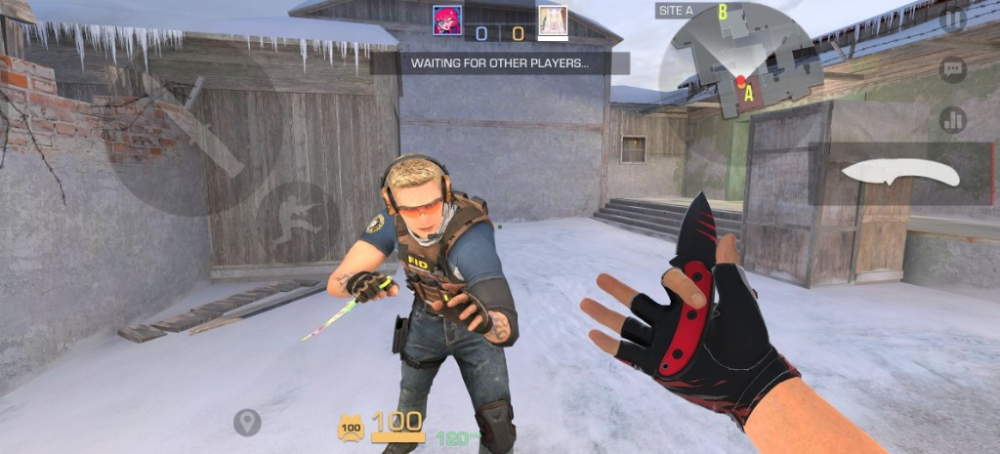
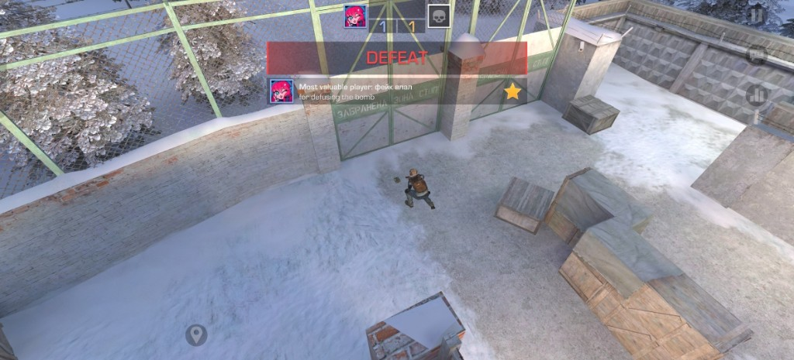

# влалChillow

LAN multiplayer **dedicated server** for [**StandChillow**](https://t.me/chillow) — a Unity mobile FPS with built-in LAN play, but no official dedicated host. This project implements a C# LAN server phones can discover and join on your local network.

Unofficial LAN dedicated server for **self-hosted multiplayer** — reverse-engineering authorized by the game owner. Not an official product and not affiliated with the game publisher.

**Supported client version:** StandChillow **2.06 OBT F1**. Other builds are untested.

## What works

- **Lobby** — LiteNetLib on UDP **7778** (join, roster, chat, mode/map selection)
- **Auto-discovery** — Bonjour V2 probe/reply on UDP **5056**; when phones search LAN lobbies, this host appears automatically (same as a phone-hosted lobby)
- **Escalation on Prison** — the only fully playable match mode today: `/mode escalation`, `/map Prison`, then `/play` → match on UDP **7777** (WarmUp → rounds → defuse/wipe/explode)

Console/chat commands (`/mode`, `/map`, `/set start`, `/play`, …) and the CLI dashboard (TTY) support the above.

**Not ready:** Ranked 2v2, Defuse, DeathMatch, and other modes are registered in the catalog but stub or partial — no reliable playable match yet. See each mode's README under `server/Net/Match/Modes/`.

## Screenshots

Escalation on Prison over LAN — from lobby ready-up through round outcomes on the dedicated host.

| Waiting for players | After bomb defuse |
|:-:|:-:|
|  |  |
| CT/T roster ready in lobby | MVP awarded on successful defuse |

## Requirements

- [.NET 8 SDK](https://dotnet.microsoft.com/download/dotnet/8.0)
- StandChillow client on the same LAN (Wi‑Fi/Ethernet; VPN interfaces are skipped for bind/advertise)
- Linux, macOS, or Windows

## Quick start

```bash
cd server
dotnet build -c Release
dotnet run -c Release
```

Phones: open StandChillow → LAN → your lobby should appear → join → chat.

### Ports

| Port | Role |
|------|------|
| **5056/udp** | Discovery only (Bonjour V2 / `sosalbolt482` probe) |
| **7778/udp** | Lobby (LiteNetLib join after discovery) |
| **7777/udp** | Match (after host starts the game) |

### Starting a match

Two steps matter:

1. **`play`** (or phone **`/play`**) — creates the match channel and moves clients to UDP 7777. Use again for rematch (tears down the previous match).
2. **`set start`** / **`start`** / **`/set start`** — arms WarmUp once both teams have at least one player. Without this, the match stays in waiting (C2=10).

Typical flow: everyone joins lobby → host runs `mode escalation` and `map Prison` → host runs `play` → both teams pick CT/T → host runs `set start` → WarmUp → live rounds.

### Useful console commands

```
mode escalation          # only mode with a full match loop today
map Prison               # Escalation is verified on Prison only
set start                # arm WarmUp when both teams ready
play                     # launch / rematch
status                   # lobby + match summary
plugins                  # list loaded plugins
quit
```

Phone chat accepts the same slash commands (`/mode`, `/map`, `/set start`, `/play`, …).

Optional lobby title as first argument:

```bash
dotnet run -c Release -- "my LAN room"
```

### ConnectAsClient (learning only)

Sniff a **real phone host** to learn protocol — do not use for production hosting:

```bash
dotnet run -c Release -- --client
```

## Plugins

Build the optional Telegram status plugin:

```bash
dotnet build -c Release plugins-src/StandChillow.Plugin.Telegram/StandChillow.Plugin.Telegram.csproj
```

Copy the DLL into `bin/Release/net8.0/plugins/` (the build target does this automatically when the main project was built first). See `server/Plugins/README.md`.

Plugins are admin/display sidecars only — they must not invent wire protocol or replay capture blobs.

## Project layout

```
server/           # Dedicated host (build & run here)
server/Plugins/   # Plugin API + loader
server/plugins-src/   # Plugin source (Telegram)
ARCHITECTURE.md   # Internal module map for contributors
```

Reverse-engineering notes and Ghidra dumps stay **local** (`decompiled/`) and are not part of the published tree.

## Protocol fidelity

Everything the server sends is derived from client reverse-engineering and observed LAN traffic. Unknown fields are logged or left unimplemented — not guessed. Discovery auth strings, LiteNetLib keys, opcodes, and game mode IDs match what the mobile client expects.

## License

This project is licensed under the [GNU General Public License v3.0](LICENSE) (GPL-3.0).

You are free to use, modify, and distribute this code. If you build on it or ship a derivative work, that work must also be open source under GPL-3.0 (copyleft).

Copyright (C) 2026 влал (vlalikoffc).

## Scope

Unofficial self-host tooling for StandChillow LAN play, with reverse-engineering authorized by the game owner. Use only on networks and instances you control.
